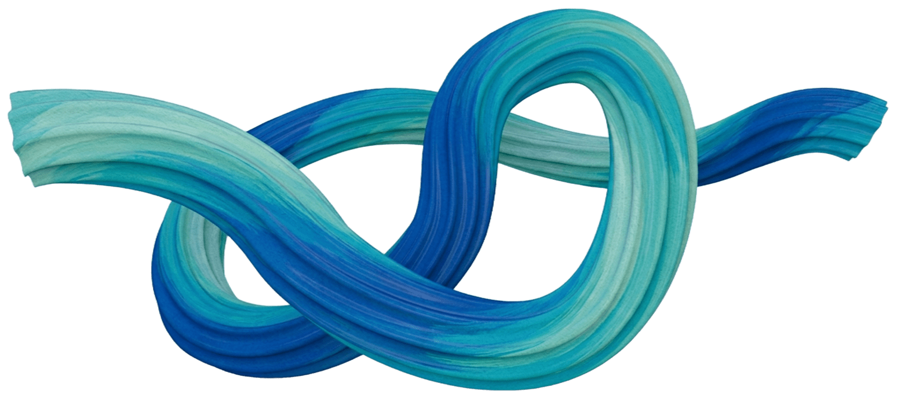
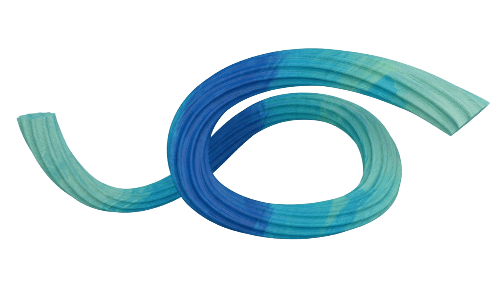

# BetterAI — Where Intelligence Finds Purpose


# Múltiplos Modelos de IA, Um Único Back-end de IA Unificado

A BetterAI é uma plataforma desenvolvida para tornar a inteligência artificial **prática, escalável e acessível** para aplicações do mundo real.

Em vez de construir uma infraestrutura complexa de IA do zero, a BetterAI oferece uma base sólida que permite às equipes integrar recursos inteligentes diretamente em seus sistemas, fluxos de trabalho e produtos.

Da análise de documentos à exploração avançada de dados, a BetterAI permite que organizações transformem dados em **inteligência acionável**.

A BetterAI reúne diversos modelos especializados de IA em uma única plataforma, projetada para gerar impacto real nos negócios.

Em vez de depender de um único tipo de inteligência artificial, a BetterAI oferece um ecossistema diversificado de recursos de IA que trabalham juntos de forma integrada.

Essa abordagem unificada permite que as organizações:

* Extraiam insights dos dados
* Automatizem fluxos de trabalho complexos
* Gerem conteúdo em diversos formatos
* Apoiem a tomada de decisões com sistemas inteligentes

Tudo isso a partir de uma **única plataforma de IA integrada**.

**Autor:** Enzo Schitini


## **Guia de Inicialização**

### **1. Atualize o Projeto**

Primeiro, certifique-se de estar na branch correta e de que o seu código está atualizado:

```
git checkout main
git pull
git checkout -b nome-da-sua-branch
```

---

### **2. Crie o Ambiente Virtual**

> **Requisito:** Python 3.14 ou superior (versão fixada em `.python-version`).
> 

Crie um ambiente virtual para isolar as dependências do projeto:

```
python -m venv .venv
```

---

### **3. Ative o Ambiente Virtual**

#### **PowerShell**

```
.\.venv\Scripts\Activate.ps1
```

#### **CMD**

```
.venv\Scripts\activate.bat
```

Após a ativação, o seu terminal deve ficar parecido com isto:

```
(.venv) PS C:\Users\nome_do_usuario\personal-finances>
```

---

### **4. Instale as Dependências**

Você pode instalar as dependências de duas formas:

#### **Usando uv (recomendado)**

```
uv sync
```

---

### **5. Configure as Variáveis de Ambiente**

Crie um arquivo `.env` na raiz do projeto com as seguintes variáveis:

| **Variável** | **Descrição** |
| --- | --- |
| `LOCAL` | Flag para execução local (`true`/`false`) |
| `DB_MONGO_NAME` | Nome do banco MongoDB |
| `DB_MONGO_HOST` | Host do MongoDB |
| `DB_MONGO_PORT` | Porta do MongoDB |
| `DB_MONGO_USER` | Usuário do MongoDB |
| `DB_MONGO_PASSWORD` | Senha do MongoDB |
| `DB_MONGO_URL` | URL de conexão MongoDB |
| `PINECONE_API_KEY` | Chave de API do Pinecone |
| `PINECONE_INDEX_NAME` | Nome do índice no Pinecone |
| `PINECONE_ENVIRONMENT` | Região/ambiente do Pinecone |
| `PINECONE_NAMESPACE` | Namespace usado no Pinecone |
| `OPENAI_API_KEY` | Chave de API da OpenAI |
| `ANTHROPIC_API_KEY` | Chave de API da Anthropic |
| `GOOGLE_API_KEY` | Chave de API do Google |
| `GEMINI_API_KEY` | Chave de API do Gemini |

```
LOCAL=true

# MongoDB
DB_MONGO_NAME=********************
DB_MONGO_HOST=********************
DB_MONGO_PORT=********************
DB_MONGO_USER=********************
DB_MONGO_PASSWORD=********************
DB_MONGO_URL=********************

# Pinecone
PINECONE_API_KEY=********************
PINECONE_INDEX_NAME=vectorstoreindex
PINECONE_ENVIRONMENT=us-east-1-aws
PINECONE_NAMESPACE=KNOWLEDGE_BASE_DEV

# LLMs
OPENAI_API_KEY=********************
ANTHROPIC_API_KEY=********************
GOOGLE_API_KEY=********************
GEMINI_API_KEY=********************
```

Caso precise das envs, abra um chamado em Dúvidas e Orientações Gerais - Suporte Infraestrutura - Jira Service Management.

---

### **6. Execute a aplicação**

Com o ambiente virtual ativado e as dependências instaladas, inicie a aplicação Streamlit:

```
streamlit run app.py
```

A aplicação ficará disponível em http://localhost:8501.


--- 

.png>)


---

